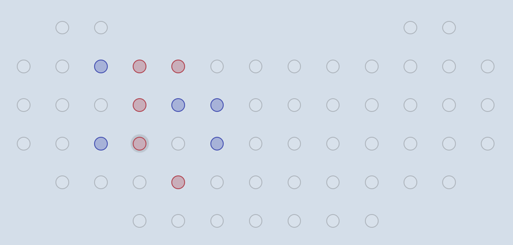

# :canoe: Canoe :canoe: Work in progress!
A tic-tac-toe like two-player strategy game.

## Objective
Players take turns placing colored pegs into available holes, one at a time. The first to complete two completed "canoes" wins. A "canoe" is formed by four pegs in this configuration (or any rotation). The two canoes may not share any pegs.

Horizontal | Vertical
---------- | --------
:white_circle: :white_circle: :white_circle: :white_circle: :white_circle: :white_circle: | :white_circle: :white_circle: :white_circle: :red_circle: :white_circle: :white_circle:
:white_circle: :red_circle: :white_circle: :white_circle: :red_circle: :white_circle: | :white_circle: :white_circle: :red_circle: :white_circle: :white_circle: :white_circle:
:white_circle: :white_circle: :red_circle: :red_circle: :white_circle: :white_circle: | :white_circle: :white_circle: :red_circle: :white_circle: :white_circle: :white_circle:
:white_circle: :white_circle: :white_circle: :white_circle: :white_circle: :white_circle: | :white_circle: :white_circle: :white_circle: :red_circle: :white_circle: :white_circle:

## Default board layout
The only available board is based on the original design by Dale Walton.

