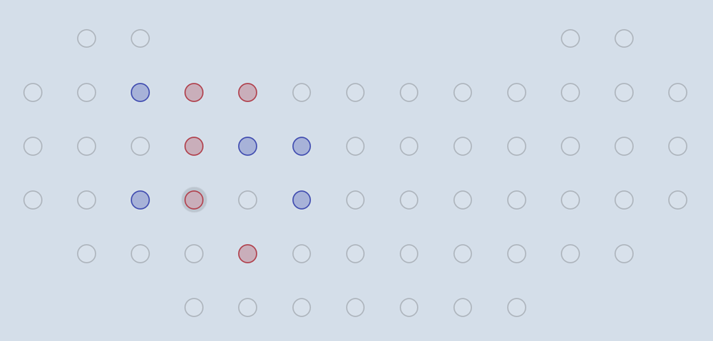

# :canoe: Canoe :canoe:
A tic-tac-toe like two-player strategy game.

## Objective
Players take turns placing colored pegs into available holes, one at a time. The first to complete two completed "canoes" wins. A "canoe" is formed by four pegs in this configuration (or any rotation). The two canoes may not share any pegs.

Horizontal | Vertical
---------- | --------
:white_circle: :white_circle: :white_circle: :white_circle: :white_circle: :white_circle: | :white_circle: :white_circle: :white_circle: :red_circle: :white_circle: :white_circle:
:white_circle: :red_circle: :white_circle: :white_circle: :red_circle: :white_circle: | :white_circle: :white_circle: :red_circle: :white_circle: :white_circle: :white_circle:
:white_circle: :white_circle: :red_circle: :red_circle: :white_circle: :white_circle: | :white_circle: :white_circle: :red_circle: :white_circle: :white_circle: :white_circle:
:white_circle: :white_circle: :white_circle: :white_circle: :white_circle: :white_circle: | :white_circle: :white_circle: :white_circle: :red_circle: :white_circle: :white_circle:


## Default board layout
The only available board is based on the original design by Dale Walton.

<p align="center"></p>


## Compiling
Compile changes into javascript and run the Elm reactor server with ```elm make src/Canoe.elm --output=assets/js/main.js && elm reactor```


## JSON Codes

### Backend -> Frontend

"action" | "content" | Description
-------- | --------- | -----------
`connect_to_server` | `""` | Server has connected. Respond with a request to create a user.
<!---
`update_board`| `[ [ 147, ... ], ... ]` | Reset `board` layout with a boundaryBoard sent from the server. Payload contains a 16x16 array of integer corresponding to a graphical representation of the board.
`update_robots`| `[ "pos": {"x": 1, "y": 2}, "color": "red", "moves": [ "up", "left" ] ]` | Update `robots` positions and sets of legal moves
`update_goals`| `[ "pos": {"x": 1, "y": 2}, "symbol": "RedMoon", "active": true ]` | Reset `goalList` positions and set the active goal
`switch_to_countdown`| `"timer": 25, "countdown": 60` | Switch clock mode to countdown (e.g. solution found)
`switch_to_timer`| `"timer": 0, "countdown": 60` | Switch clock mode to timer (e.g. new game)
`clear_moves_queue`| `""` | Force `movesQueue` to clear, e.g. upon a new game.
`update_scoreboard`| `[ {"username": "User", "color": "#faefa0", "score": 5, "is_admin": true, "is_muted": false} ]` | Update `users` names, colors, scores and all (for example, after each round is scored).
`update_user`| `{"username": "User", "color": "#faefa0", "score": 5, "is_admin": true, "is_muted": false}` | Update current `user` name, color, etc.
`update_chat`| `{"user": <User>, "msg": "Hello!", "kind": 0}` | Update `chat`
-->
To be continued

### Frontend -> Backend
"action" | "content" | Description
-------- | --------- | -----------
`submit_move` | `{"team": 1, "pos": {"x": x, "y": y}`| Submit list of moves
`create_user` | `""` | Add user
`update_user` | `{"username": "User", "color": "#faefa0", "score": 5, "is_admin": true, "is_muted": false}` | Update user
`update_chat` | `{"user": <User>, "msg": "Hello!", "kind": 0}` | Send chat message
`ping` | `"ping"` | Send "ping" every 50 seconds to maintain the connection.
